<p align="center">
  
</p>

# Lemonade UI

Lemonade UI is a playful beta lab for animated, interactive interface components.

It is early, a little experimental, and intentionally alive. The goal is to build components that feel useful in real products, not just pretty in a screenshot.

## Beta Note

This library is still in beta. Component APIs, file names, and examples may change while the collection is being shaped.

Design credit is coming next. Each component page will include proper credit for the visual reference or inspiration behind that component.

## What Is Inside

- Animated components built for real interaction.
- Copyable usage examples for each component.
- Multiple install command styles where useful.
- Component detail pages with preview, code, dependencies, and AI prompt helpers.
- Motion handled with GSAP where it gives the component a better feel.

## Local Setup

```bash
npm install
npm run dev
```

Open [http://localhost:3000](http://localhost:3000) and start playing with the lab.

## Useful Commands

```bash
npm run dev
npm run lint
npm run build
```

## Project Shape

```txt
src/components/lemonade/        component source
src/components/catalog/items/   component page entries
src/components/catalog/         catalog UI and install helpers
public/r/                       generated install payloads
```

## Built With

- Next.js
- React
- Tailwind CSS
- GSAP
- lucide-react
- Codex, as the build partner

## Status

The lab is open, but the paint is still wet. Expect fast changes, better examples, and more component credits as the library grows.
